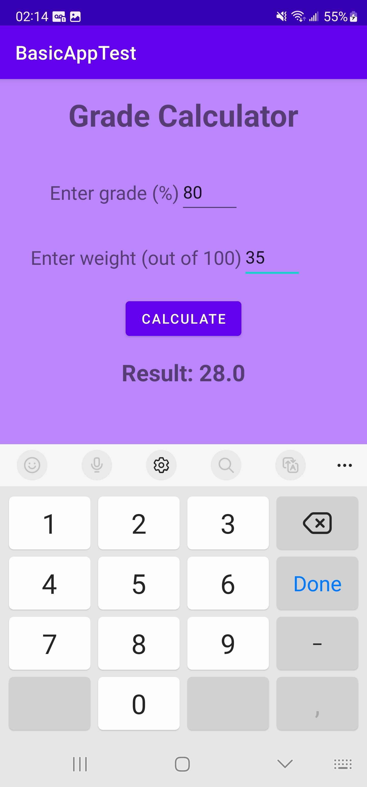

# Basic-App-Test-Kotlin

Using Kotlin and xml I made a basic app used to calculate how much a grade is worth overall based on its weight.

### Versions
[<b>Kotlin</b>](https://github.com/Wavedoo/Basic-App-Test-Kotlin)  
[Java](https://github.com/Wavedoo/Basic-App-Test-Java)

## The process
The app took about 2 hours to make  
I had a bit of trouble adapting to xml with a big issue slowing me down was not realizing I accidentally closed a LinearLayout  
It was really fun to learn this stuff. Working with user input is much easier here than in Jetpack Compose.

## Screenshots
<b>No inputs</b>
 

 
<b>All inputs</b>
 

